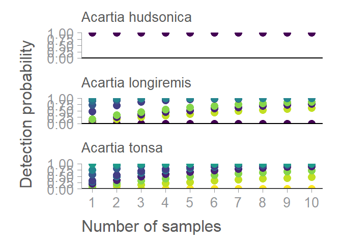
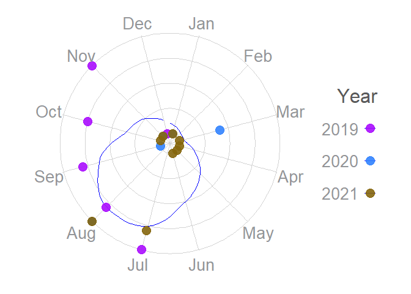

<!-- README.md is generated from README.Rmd. Please edit that file -->

# GOTeDNA

## An R package for guidance on optimal eDNA sampling periods to develop, optimize, and interpret monitoring programs

<!-- badges: start -->
<!-- badges: end -->

The goal of GOTeDNA is to import and format eDNA qPCR and metabarcoding
metadata/data from GOTeDNA sample templates, visualize species detection
periods, and statistically delineate optimal species detection windows.

## Installation

### non-R users

#### Install R

We recommend to use R and RStudio:
<https://posit.co/download/rstudio-desktop/>

1.  Download R for your OS: <https://cran.rstudio.com/>

2.  Install R Studio

#### Install the package

You first need to have access to the archive `GoteDNA_{version}.tar.gz`.
Once you have obtained the archive, use the following:

``` r
install.packages("path/to/GoteDNA_{version}.tar.gz")
```

### R users with access to the GitHub repository

You can install the development version of GOTeDNA from
[GitHub](https://github.com/) with:

``` r
# install.packages("devtools")
devtools::install_github("AnaisLacoursiereRoussel/GOTeDNA")
devtools::install_github("AnaisLacoursiereRoussel/GOTeDNA", dependencies = TRUE)
```

Or if you have a local copy of the repo:

``` r
install.packages("devtools")
devtools::install_local("path/to/the/repo", dependencies = TRUE)
```

## Usage

### R function categories:

- Import data
- Clean/tidy data
- Visualization

``` r
library("GOTeDNA")
```

### Clean/tidy data

``` r
newprob <- calc_det_prob(data = D_mb_ex)
scaledprobs <- scale_newprob(D_mb_ex, newprob)
win <- calc_window(
  data = D_mb_ex, 
  threshold = "75", 
  taxon.level = "species",
  taxon.name = "Acartia longiremis", 
  scaledprobs
)
```

### Heat map

``` r
hm_fig(
   taxon.level = "class", 
   taxon.name = "Copepoda", 
   scaledprobs)
#> Warning in ggplot2::geom_tile(dplyr::filter(scaledprobs, `Detection rate` > :
#> Ignoring unknown aesthetics: text
```


### Effort needed

``` r
effort_needed_fig(
  taxon.level = "genus",
  taxon.name ="Acartia",
  scaledprobs
)
#> Warning in grid.Call(C_stringMetric, as.graphicsAnnot(x$label)): font family
#> not found in Windows font database

#> Warning in grid.Call(C_stringMetric, as.graphicsAnnot(x$label)): font family
#> not found in Windows font database
#> Warning in grid.Call.graphics(C_text, as.graphicsAnnot(x$label), x$x, x$y, :
#> font family not found in Windows font database

#> Warning in grid.Call.graphics(C_text, as.graphicsAnnot(x$label), x$x, x$y, :
#> font family not found in Windows font database

#> Warning in grid.Call.graphics(C_text, as.graphicsAnnot(x$label), x$x, x$y, :
#> font family not found in Windows font database
```



### Sampling effort

``` r
field_sample_fig(
  data = D_mb_ex, 
  taxon.level = "genus", 
  taxon.name = "Acartia"
)
#> Warning in grid.Call(C_textBounds, as.graphicsAnnot(x$label), x$x, x$y, : font
#> family not found in Windows font database
#> Warning in grid.Call(C_stringMetric, as.graphicsAnnot(x$label)): font family
#> not found in Windows font database
#> Warning in grid.Call(C_textBounds, as.graphicsAnnot(x$label), x$x, x$y, : font
#> family not found in Windows font database

#> Warning in grid.Call(C_textBounds, as.graphicsAnnot(x$label), x$x, x$y, : font
#> family not found in Windows font database

#> Warning in grid.Call(C_textBounds, as.graphicsAnnot(x$label), x$x, x$y, : font
#> family not found in Windows font database

#> Warning in grid.Call(C_textBounds, as.graphicsAnnot(x$label), x$x, x$y, : font
#> family not found in Windows font database
#> Warning in grid.Call.graphics(C_text, as.graphicsAnnot(x$label), x$x, x$y, :
#> font family not found in Windows font database

#> Warning in grid.Call.graphics(C_text, as.graphicsAnnot(x$label), x$x, x$y, :
#> font family not found in Windows font database

#> Warning in grid.Call.graphics(C_text, as.graphicsAnnot(x$label), x$x, x$y, :
#> font family not found in Windows font database

#> Warning in grid.Call.graphics(C_text, as.graphicsAnnot(x$label), x$x, x$y, :
#> font family not found in Windows font database

#> Warning in grid.Call.graphics(C_text, as.graphicsAnnot(x$label), x$x, x$y, :
#> font family not found in Windows font database

#> Warning in grid.Call.graphics(C_text, as.graphicsAnnot(x$label), x$x, x$y, :
#> font family not found in Windows font database

#> Warning in grid.Call.graphics(C_text, as.graphicsAnnot(x$label), x$x, x$y, :
#> font family not found in Windows font database

#> Warning in grid.Call.graphics(C_text, as.graphicsAnnot(x$label), x$x, x$y, :
#> font family not found in Windows font database
```


### Species monthly detection

``` r

smooth_fig(
  data = D_mb_ex, 
  taxon.level = "species",
  taxon.name = "Acartia longiremis"
)
#> $`2.3`
#> Warning: Removed 1 row containing missing values or values outside the scale range
#> (`geom_vline()`).
#> Warning: Removed 4 rows containing missing values or values outside the scale range
#> (`geom_path()`).
#> Warning in grid.Call(C_textBounds, as.graphicsAnnot(x$label), x$x, x$y, : font
#> family not found in Windows font database

#> Warning in grid.Call(C_textBounds, as.graphicsAnnot(x$label), x$x, x$y, : font
#> family not found in Windows font database
#> Warning in grid.Call.graphics(C_text, as.graphicsAnnot(x$label), x$x, x$y, :
#> font family not found in Windows font database

#> Warning in grid.Call.graphics(C_text, as.graphicsAnnot(x$label), x$x, x$y, :
#> font family not found in Windows font database

#> Warning in grid.Call.graphics(C_text, as.graphicsAnnot(x$label), x$x, x$y, :
#> font family not found in Windows font database
```



### Monthly detection probabilities

``` r
thresh_fig(
  taxon.level = "species", 
  taxon.name = "Acartia longiremis", 
  threshold = "75", 
  scaledprobs)
#> $`2.3`
#> Warning in grid.Call(C_textBounds, as.graphicsAnnot(x$label), x$x, x$y, : font
#> family not found in Windows font database
```


### Shiny

Once the package loaded, the shiny can be launched using the following
function.

``` r
run_gotedna_app()
```

There is also a docker file available:

``` sh
# build the container 
docker build -t gotedna . 
# use the container
docker run -it --rm --network host gotedna 
# the shiny will be available at http://0.0.0.0:9292
```
