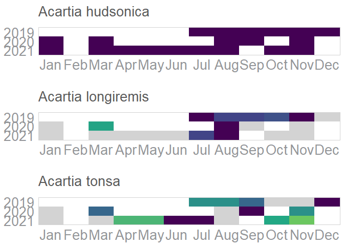
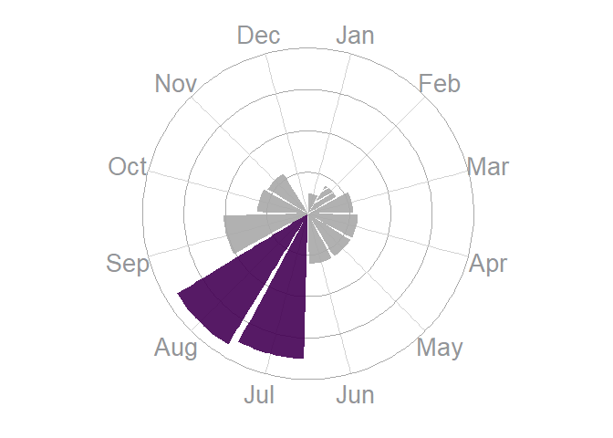

<!-- README.md is generated from README.Rmd. Please edit that file -->

# GOTeDNA

## An R package for guidance on optimal eDNA sampling periods to develop, optimize, and interpret monitoring programs

<!-- badges: start -->
<!-- badges: end -->

The goal of GOTeDNA is to import and format eDNA qPCR and metabarcoding
metadata/data from GOTeDNA sample templates, visualize species detection
periods, and statistically delineate optimal species detection windows.

## Installation

You can install the development version of GOTeDNA from
[GitHub](https://github.com/) with:

``` r
# install.packages("devtools")
devtools::install_github("mkmor/GOTeDNA")
```

## Usage

### R function categories:

-   Import data
-   Clean/tidy data
-   Visualization

``` r
library("GOTeDNA")
```

### Clean/tidy data

``` r
newprob <- calc_det_prob(data = D_mb_ex)
scaledprobs <- scale_newprob(D_mb_ex, newprob)
win <- calc_window(
  data = D_mb_ex, threshold = "90", species.name = "Acartia longiremis",scaledprobs
)
```

### Heat map

``` r
hm_fig(
   taxon.level = "class", taxon.name = "Copepoda", scaledprobs)
```



### Effort needed

``` r
effort_needed_fig(
  species.name = "Acartia hudsonica", primer.select = "COI1", scaledprobs
)
```


ecodistrict.select = “Scotian Shelf”, \### Sampling effort

``` r
higher_tax_fig(
  data = D_mb_ex, 
  higher.taxon.select = "phylum", 
  taxon.name = "Bryozoa",
  view.by.level = "genus", 
  primer.select = "COI1"
)
```


### Sample size

``` r
sample_size_fig(data = D_mb_ex, species.name = "Acartia hudsonica")
```


### Species monthly detection

``` r
smooth_fig(
  data = D_mb_ex, species.name = "Acartia longiremis",
  primer.select = "COI1"
)
#> Warning in RColorBrewer::brewer.pal(length(unique(data$year)), "Dark2"): minimal value for n is 3, returning requested palette with 3 different levels
```


### Monthly detection probabilities

``` r
thresh_fig(taxon.level = "species", taxon.name = "Acartia hudsonica", 
  threshold = "75", scaledprobs)
```



### Shiny

Once the package loaded, the shiny can be launched using the following
function.

``` r
run_gotedna_app()
```

There is also a docker file available:

``` sh
# build the container 
docker build -t gotedna . 
# use the container
docker run -it --rm --network host gotedna 
# the shiny will be available at http://0.0.0.0:9292
```
